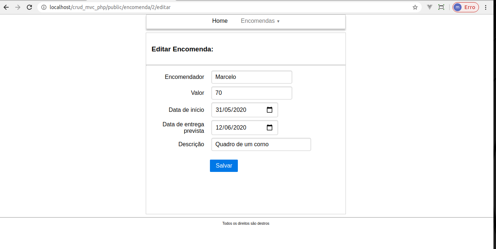

# crud_mvc_php
Estudando MVC e construindo um registro de encomendas em PHP
## Tecnologias utilizadas:
 - PHP 7
 - PHP MVC
 - PURE CSS
 - MYSQL
### Listagem de dados:

### Nova encomenda:

### Editando dados:
